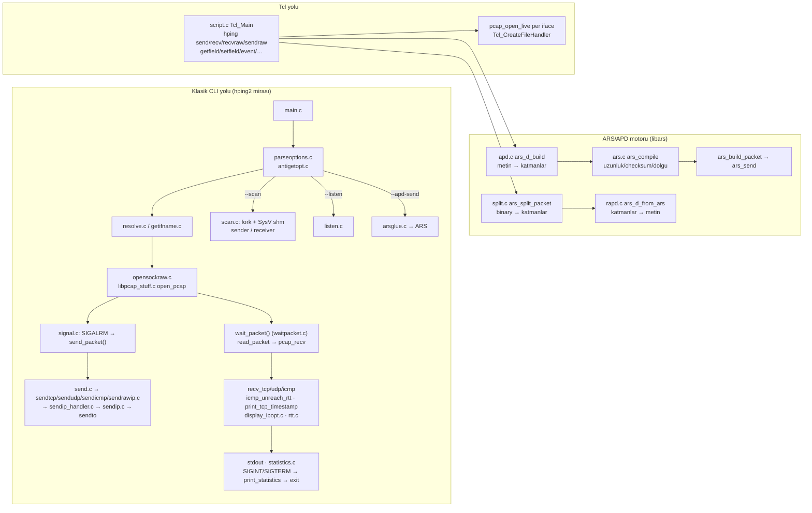

# hping3 — Aşama 1 raporu: güvenilir derleme ve kritik düzeltmeler

Referans commit: `3547c7691742c6eaa31f8402e0ccbb81387c1b99` (master). Bu rapor
`docs/PROFESYONEL_GELISTIRME_PROMPTU.md` içindeki başlangıç komutunun ilk
teslimatıdır: depo ve ön bulgular doğrulandı, derleme başlangıcı kaydedildi,
Aşama 1 (derleme + bellek/parser doğruluğu + regresyon testleri) uygulandı.

Satır numaraları aksi belirtilmedikçe referans commit'e aittir; "yeni" ile
işaretlenenler bu teslimattaki koda aittir.

---

## 1. Kısa değerlendirme

**Başlangıç durumu.** Referans commit, güncel bir Linux araç zincirinde
(GCC 16 / Clang 22, glibc 2.44, libpcap 1.10.6, Tcl 8.6.16) derlenemiyordu:
`libpcap_stuff.c:19` ve `script.c:26` Linux'ta bulunmayan `net/bpf.h` başlığını
istiyor; bu aşılsa bile `hping2.h:360`'taki `delaytable` tanımı (başlık içinde
tentative definition) GCC ≥ 10'un varsayılanı olan `-fno-common` ile
"multiple definition" bağlama hatası veriyordu. `configure --no-tcl` Tcl
keşfinden sonra işlendiği için boş `$TCLSH` ile `[ -f ]` doğru sayılıyor ve
`line 81: -: command not found` tanısı üretiliyordu; sürüm listesi 8.0–8.4 ile
sınırlıydı; kurulum `/usr/sbin`'e sabitti.

**En önemli problemler.** Alım yolunda (libpcap → `wait_packet` → protokol
çözümleyicileri) ve ARS paket motorunda (`split.c`, `rapd.c`, `apd.c`,
`ars.c`) paket üstbilgisindeki *iddia edilen* uzunluklar, yakalanan/verilen
gerçek uzunluk yerine kullanılıyordu. Sonuç: kesilmiş veya kötü biçimli bir
paketle yığın/stack sınır dışı okuma-yazma, sıfır uzunluklu TCP seçeneğinde
sonsuz döngü, `tot_len < IHL` durumunda `size_t` taşması, TCP seçenek
dolgulamasında use-after-free (bu sonuncusu ön incelemede yoktu, ASan altında
testler buldu). CLI tarafında sayısal argümanlar denetimsizdi ve `--faster`
yanlışlıkla `--tr-keep-ttl`'yi de açıyordu.

**Kullanıcıya etkisi.** Ağ mühendisi/araştırmacı açısından: araç yakalanan
her yanıtı kendi tamponu kadar güvenilir işleyemiyordu; Tcl'de çoklu paket
alımı ikinci paketten itibaren yanlış içerik döndürüyordu; APD ile
`tcp.ts(...)` alanları sessizce yok sayılıyordu; `hping recv` çıktısı
(`tcp.timestamp`, `tcp.echoreq`, IP `cksum` bayt sırası) geri
ayrıştırılamıyordu. Bu teslimatla derleme iki varyantta (Tcl açık/kapalı) ve
iki derleyicide (GCC/Clang) `-Werror` ile temiz; 500 kontrollü çevrimdışı
test paketi root ve ağ gerektirmeden geçiyor; ASan/UBSan altında temiz.

---

## 2. Kanıtlı analiz

### 2.1 Mimari ve akışlar

- **Başlatma → doğrulama:** `main()` argüman sayısına göre Tcl kabuğu ya da
  CLI seçer; `parse_options()` seçenekleri global değişkenlere yazar, bazı
  seçenekler yan etkilidir (`--apd-send` ayrıştırma sırasında gönderip
  `exit(0)` yapar; `--help/--version/--tos help` yazıp çıkar).
- **Paket oluşturma → gönderme:** SIGALRM işleyicisi `send_packet()`
  içinde `malloc`, `printf`, `sendto` ve `exit` çağrılıyor (async-signal-safe
  değil; Aşama 2 konusu). Uzunluk/checksum hesapları protokol başına ayrı
  dosyalarda; ARS'de aynı iş `ars_compiler_*` içinde ikinci kez uygulanmış
  (çoğaltılmış protokol mantığı: `cksum.c` ↔ `ars_cksum`, `sendtcp.c` ↔
  `ars_compiler_tcp`, `ip_opt_build.c` ↔ `ars_add_ipopt`).
- **Alma → yorumlama → çıktı:** `pcap_recv()` tek global `pcapfp` üzerinden
  bloklar; `wait_packet()` link başlığını `linkhdr_size` ile atlar,
  `delaytable` üzerinden RTT hesaplar, sayım dolunca `print_statistics()`
  ile `exit()`.
- **Kapanış:** yalnızca `exit()`; `init/run/stop/destroy` yaşam döngüsü yok.
  `scan.c` paylaşımlı belleği `volatile` olmadan iki süreç arasında
  kilitsiz kullanır (kendi yorumuyla "x86'da güvenli").
- **Platform sınırları:** `getifname.c`/`interface.c` Linux+Solaris ve BSD
  ailesi için iki ayrı gerçekleme; `sendip.c` BSD'de `tot_len/frag_off`
  host sırası; `libpcap_stuff.c` BSD'de `BIOCIMMEDIATE`.

Doğrudan `exit()` çağrıları: `main.c`, `parseoptions.c` (≥ 15), `send.c`,
`sendicmp.c`, `sendip.c`, `waitpacket.c`, `statistics.c`, `scan.c`,
`arsglue.c`, `resolve.c`, `datafiller.c`, `usage.c`, `version.c`.

### 2.2 Derleme başlangıcı (ham sonuçlar)

Ortam: Linux 7.2.2 (CachyOS) x86_64, GCC 16.2.1, Clang 22.1.8, GNU Make
4.4.1, glibc 2.44, libpcap 1.10.6 (pkg-config), Tcl 8.6.16 (pkg-config,
`/usr/include/tcl.h`, `tclsh8.6`); `tclsh9.0` yok.

| Adım (temiz `git archive` kopyası) | Sonuç |
|---|---|
| `./configure --no-tcl` | çıkış 0, `./configure: line 81: -: command not found` |
| `make -j2` | çıkış 2, `libpcap_stuff.c:19:10: fatal error: net/bpf.h` |
| `make -k` + geçici `net/bpf.h` şimi | tüm nesneler derlendi, **bağlama hatası**: `multiple definition of 'delaytable'` (hping2.h:360, her çeviri biriminde) |
| GCC `-Wall` uyarı envanteri (şimle) | 6: `scan.c:459` `-Warray-bounds` (8 baytlık `icmp`'ye 20 bayt), `ars.c:485` `-Waddress`, `libpcap_stuff.c:26`/`ars.c:909`/`apd.c:889` set-but-unused |
| Clang `-Wall -Wextra` (syntax-only) | 31 sınıf; öne çıkanlar: `send.c` `-Wfortify-source` (`%4[` → 5 bayt gerekir), `scan.c` "memcpy will always overflow (8 < 20)", `scan.c:193` 16 baytlık dizi 17 baytlık başlatıcı, `script.c` `Tcl_ObjType*` const kaybı, çok sayıda `-Wsign-compare` |

### 2.3 Bulgular

Kanıt türleri: **T** = bu teslimattaki regresyon testi eski dosyayla
ASan/UBSan altında hatayı gösterdi (`tests/` + geçici kopya, bkz. §5.3);
**D** = derleyici tanısı; **K** = kod okuması (test edilemedi veya
gözlemlenemez); **R** = potansiyel risk.

| # | Öncelik | Konum (ref. commit) | Tetikleyici → gözlenen | Beklenen / etki | Kanıt | Düzeltme (yeni kod) |
|---|---|---|---|---|---|---|
| 1 | P0 | `libpcap_stuff.c:66–73` | caplen > tampon → `memcpy` caplen kadar | Tampon kapasitesiyle sınırla; kesilmeyi bildir | T (`test_core` pcap_recv: 100 baytlık kare 40 baytlık tampona, eski kod 100 döndürdü + EOF'ta sonsuz döngü) | `pcap_next_ex`, min(caplen,size), debug mesajı, hata/EOF'ta −1 |
| 2 | P0 | `scan.c:455–463` | ICMP yanıtı → `memcpy(&icmp,p,sizeof(subtcp))` 8 baytlık yapıya 20 bayt | Stack yazma taşması | D (`-Warray-bounds`, clang fortify) + T (yeni `scan_process_packet`) | boyut `sizeof(icmp)`; `iplen−iphdrlen` işaretli karşılaştırma; IHL<5 ve IHL>iplen reddi |
| 3 | P0 | `waitpacket.c:440–447` | ICMP hata içinde 2–7 baytlık alıntı taşıma başlığı → 8 bayt kopya | Sınır dışı okuma | T (`test_waitpacket`, ASan "unknown-crash" `waitpacket.c:454`) | yalnızca 2 baytlık port kopyalanır; alıntı IHL<5 ve IHL>alıntı reddi |
| 4 | P0 | `waitpacket.c:454–457` | alıntı ICMP başlığı uzunluk denetiminden önce kopyalanır | Sınır dışı okuma | T | denetim önce, kopya sonra |
| 5 | P0 | `waitpacket.c:623, 638–643` | `tcphdrlen < tcpsize` ters koşul; `opt[1]==0` → ilerleme yok | Kesik başlıkta taşma; sonsuz döngü; veri taşıyan segmentte timestamp hiç basılmıyordu | T (zero-len option, doff>captured, payload'lı segmentte ts bulunur) | `tcphdrlen > tcpsize` → çık; `opt[1]<2` → çık |
| 6 | P0 | `waitpacket.c:754` | `size-(packet-p)` işaret ters → her zaman büyük | HCMP başlığı paket sonundan okunur | T (imza paketin sonunda) | `size − (p − packet)` |
| 7 | P0 | `display_ipopt.c:93–112` | RR `len/ptr` alanından türeyen `i` ile `memcpy(old_rr,…)` ve yürüyüş | 40 baytlık statik tampona/paket dışına | T (ASan stack-buffer-overflow `display_ipopt.c:112`) | seçenek alanı, `len` ve `ptr` sınırlı yeniden yazım; çıktı biçimi korundu |
| 8 | P0 | `script.c:330–347` | `hping recv` çoklu paket: `pkt += lhs` her turda, okuma tam boyutla | 2. paketten itibaren yanlış içerik; tampon aşımı | T (`test_script`: 3 Ethernet karesi, eski kodla 2. paket `ip(` ile başlamaz — yeni API'yle test; eski davranış K) | her turda `pkt=_pkt`; `len>lhs` denetimi; okuma hatası → Tcl hatası |
| 9 | P0 | `send.c:42–44` | `%4[^.]` 4 baytlık dizilere 5 bayt | Stack taşması | D (clang `-Wfortify-source`) + T (`parse_rand_dest`) | 5 baytlık tamponlar, 0–255/`x` doğrulaması |
| 10 | P0 | `memstr.c:19–23` | `char needlesize`; `haystack-needlesize+size` sınırı | 127+ imzada negatif; `size<needle` ile taşma | T (ASan negative-size-param) | `size_t`, `p+needle ≤ haystack+size` |
| 11 | P0 | `sendicmp.c:256, 262` | `left_space` (=28+data) kadar 20/8 baytlık kaynaklardan kopya | Stack/yığın okuma taşması | T (ASan `sendicmp.c:256`) | tam `IPHDR_SIZE`/`UDPHDR_SIZE` |
| 12 | P0 | `split.c:375, 388, 340–341` | `th_off` boyut denetiminden önce; `newtcp->th_sum=0`/`uh_sum=0` `size` baytlık geçici katmana (size<18/8 → yığın yazma) | Kesik TCP/UDP başlığında OOB | T (1..19 bayt TCP, 1..7 bayt UDP) | önce boyut; kesikte checksum atlanır |
| 13 | P0 | `split.c:140, 143` | `size=MIN(size,tot_len)` sonra `size-=len`, `tot_len<20` → `size_t` taşması | ICMP yolunda `alloca(~2^64)` çökme | T (`tot_len=10`) | `tot_len<len` → `len` |
| 14 | P0 | `split.c:228, 431` | seçenek `kind/len` alanı `size` denetiminden önce (size=1 → 1 bayt OOB); SACK-permitted 1 bayt sayılıyordu | OOB okuma; sonraki seçenekler yanlış ayrışır | T + UBSan misaligned | sıra düzeltildi; uzunluk baytı yoksa FTRUNC; SACK-perm 2 bayt |
| 15 | P0 | `rapd.c:101, 286` | `memcpy(&ipopt, l_data, len)` 40/34 baytlık stack yapısına 255'e kadar | Stack taşması | T (RR len 255, SACK len 255, unknown len 255) | `MIN(len,sizeof)`; `optlen ≤ len`; SACK ≤ 4 blok |
| 16 | P0 | `rapd.c:128–135, 164–166, 188, 310–315, 353` | `optlen` (paketin iddia ettiği) ile katman dışı okuma; `sack[i]` i≥4 | OOB okuma | T + UBSan (`rapd.c:314` index 4 out of bounds) | tüm döngüler `len` ile sınırlı |
| 17 | P0 | `ars.c:427, 473` | tek baytlık artıkta 16 bit okuma | 1 bayt OOB okuma (her tek uzunluklu paket/veri) | T (ASan `ars_cksum ars.c:427`) | `memcpy` tabanlı, endian-bağımsız artık bayt |
| 18 | P0 | `ars.c:785` (`ars_compiler_tcpopt`) | `realloc` sonucu `l_data`'ya yazılmıyor | **Use-after-free** (ör. `tcp.mss+tcp.ts` = 14 bayt → dolgu) — `lib/regtest/rt0.htcl` aynı hatanın IP seçenekleri için düzeltildiğini not ediyor | T (ASan heap-use-after-free `ars.c:473 ← :723 ← :752`) | `l_data = t` |
| 19 | P0 | `ars.c:687–693` | TCP/UDP katmanı 0 iken `p_layer[-1]` | OOB okuma (`--apd-send "tcp(...)"`) | K + T (yeni kod hata döndürür) | `j<0` denetimi |
| 20 | P1 | `hping2.h:360` | başlıkta tanım | GCC≥10 bağlama hatası | D | `extern` |
| 21 | P1 | `libpcap_stuff.c:19`, `script.c:26` | `net/bpf.h` | Linux derlenmez | D | `HAVE_NET_BPF_H` (configure) + `#ifdef BIOCIMMEDIATE` |
| 22 | P1 | `globals.h:134` ↔ `main.c:157` | `ip_optlen` `char` bildirim / `unsigned` tanım | Tür uyuşmazlığı (LE'de tesadüfen çalışır) | K | `extern unsigned int` |
| 23 | P1 | `parseoptions.c:507–513` | `--faster` sonunda `break` yok | `--tr-keep-ttl` da açılır | K (D yok: GCC implicit-fallthrough uyarısı `-Wall`'da değil) | `break` |
| 24 | P1 | `parseoptions.c:236–339, 448–495`, `usage.c:24–25` | `strtol` denetimsiz; `--fast` metni `u10000`, `--faster` `u1000`, `-w` "default 64" | `-t 300` → 44; `-c abc` → 0 (hata mesajı yanlış) | T (`cli.sh`) | `opt_num/opt_unum` (endptr/errno/aralık), yardım ve man düzeltildi |
| 25 | P1 | `apd.c:112,136`, `rapd.c:329,346` | `tcp.ts` boş setter; rapd `tcp.timestamp`/`tcp.echoreq` üretir | Alanlar sessizce yok sayılır; çıktı geri ayrışmaz | T (`tcp.ts(val,ecr)` baytları, alias'lar, bilinmeyen alan hata) | gerçek setter; kanonik `tcp.ts`/`tcp.echo` + alias'lar |
| 26 | P1 | `rapd.c:80` | IP `cksum=0x%04x` `ntohs`'siz | LE'de round-trip bayt sırası bozuk | T (bayt-eşit round trip) | `ntohs` |
| 27 | P1 | `apd.c:559` | `shift = htons(...)` 8 bitlik alana | `tcp.wscale(shift=7)` → 0 | T | `htons` kaldırıldı |
| 28 | P1 | `apd.c:785–853`, `hex.c:9,52` | `int hextab` `memset(255)`; `char hval[256]={255}` işaretli | Geçersiz hex kabul edilir; `\xx` kaçışları çöp üretir | T (hex "zz", "0g"; str `\41`, `\zz`) | `hexval()`; `unsigned char hval` |
| 29 | P1 | `apd.c:430` | `tcc` için `hextobin(&h, v, 6)` | 3 bayt `h`(2)+`tcc[0]` | T | `tcc` hedefi |
| 30 | P1 | `script.c:777–779` | boş script → dosya olayı kaldırılmıyor | olay döngüsü `rh_interp=NULL` ile `Tcl_EvalObjEx` → çökme | K (canlı arayüz gerekir) | `Tcl_DeleteFileHandler` |
| 31 | P1 | `script.c:400–403, 558, 587, 616, 647` | `Tcl_GetIntFromObj` dönüşü denetimsiz | `hping recv lo abc` → 0 olarak | T | hata yayılır; `maxpackets<0` reddi |
| 32 | P1 | `script.c:263–284` | `GetPacketDescription` tahsis/split/rapd hatalarını yutar | Boş/yanlış açıklama | T | NULL + Tcl hata mesajı |
| 33 | P1 | `script.c:233, 358` | `sendraw` string, `recvraw` `Tcl_NewStringObj` ile ikili veri | ≥0x80 baytlar UTF-8'e dönüşür | T (byte array kontrolü) | byte array (API.txt "raw binary data" sözleşmesi) |
| 34 | P1 | `script.c:1011` | `internalRep.longValue` ile pointer okuma | Tür cezalandırma (Tcl 9'da kırılgan) | K | `otherValuePtr` |
| 35 | P1 | `scan.c:227, 242–246, 253–254` | `strftok` orijinal metni bozar; `1-` → `range[1]` başlatılmamış; `1-70000` tablo dışı yazma | OOB yazma (shm) / UB | T (`test_scan`) | kopya üzerinde; dönüş 2 denetimi; aralık sınırı |
| 36 | P1 | `scan.c:193` | `"FSRPAYXY"` | URG `Y` basılır; 17 baytlık başlatıcı | D (clang) | `"FSRPAUXY"` |
| 37 | P1 | `sbignum.c:495, 508` | `1<<(ATOMBITS-1)` işaretli | UB (UBSan) | T (bignum testleri) | `(mpz_atom_t)1` |
| 38 | P1 | `strlcpy.c:54` | K&R tanım; glibc 2.38+ kendi `strlcpy`'sini sağlar | Çift tanım / C23 uyumsuzluk | D (clang) | `HAVE_STRLCPY` keşfi; prototipli tanım |
| 39 | P1 | `configure:64–113`, `Makefile.in:9–12, 74–85` | sabit Tcl 8.0–8.4 listesi; `CC=gcc` sabit; `/usr/sbin` sabit; mutlak symlink | Kurulum/keşif | T (`install.sh`, configure hata kodları) | bkz. §4.1 |
| 40 | P2 | `main.c:294–300`, `send.c:66–91`, `statistics.c:22–52` | sinyal bağlamında `malloc/printf/sendto/exit` | Async-signal-safe değil; nadir çökme/kilitlenme | R (K) | **Aşama 2** (olay döngüsü) |
| 41 | P2 | `getusec.c:24–28`, `rtt.c:57–58` | `milliseconds()` gün sonunda sıfırlanır; `time()`+`get_usec()` ayrı okumalar | Gece yarısı `hping recv` zaman aşımı; saniye sınırında ~1 s hata | R (K) | **Aşama 2** (monotonik saat) |
| 42 | P2 | `script.c:1340–1348` | `~/.hpingrc` koşulsuz yüklenir, hata yutulur | Testler ortam bağımlı | K; testler `HOME`'u geçici dizine alır | **Aşama 3** (açık seçenek) |
| 43 | P2 | `docs/APD.txt:7–29` | `{}` sözdizimi ve `ipopt.*/tcpopt.*` adları kodla uyumsuz (`()` ve `ip.*/tcp.*`) | Belge yanıltıcı | K | **Aşama 3** (gramer belgesi) |
| 44 | P2 | `docs/hping3.8:1` `HPING2`, `README` CVS | Tarihî içerik | — | K | README güncellendi; man başlığı Aşama 4 |

Doğrulanamayan/dayanaksız iddia üretilmedi: CVE, risk puanı ve uzaktan
istismar senaryosu bu raporun kapsamı dışındadır; yukarıdaki tüm bulgular
yerel, çevrimdışı olarak yeniden üretilmiştir.

### 2.4 Korunacak davranış matrisi (karakterizasyon)

| Alan | Davranış | Test |
|---|---|---|
| CLI | `--help`/`--version`/`-h`/`-v`: stdout'a yazar, stderr boş, çıkış 0, root/DNS/ağ gerekmez | `cli.sh` |
| CLI | argümansız çalıştırma: Tcl'li binary'de Tcl kabuğu (stdin EOF → 0), Tcl'siz "compiled without TCL" + çıkış 1 | `cli.sh` |
| CLI | hedef yok → "missing host argument", çıkış 1; bilinmeyen seçenek → "unrecognized option", çıkış 1 | `cli.sh` |
| CLI | `-E` `-d`'siz, `--rand-dest` `-I`'sız vb. mevcut seçenek-kombinasyon hataları | `cli.sh` |
| CLI | `--badcksum` bilerek bozuk checksum üretmeye devam eder | `test_core` cksum |
| CLI/exit | `--tcpexitcode` ve `recv_pkt>0 → 0 / 1` çıkış sözleşmesi değişmedi (kod okuması; canlı test yok) | — |
| APD | `ip(...)+tcp(...)` → 40 baytlık geçerli paket, IP/TCP checksum'ları bağımsız hesaplamayla eşit | `test_core` vektör |
| APD | açık `cksum=`/`totlen=` değerleri (kasıtlı hatalı) korunur | `test_core` |
| APD | seçenek dolgusu NOP ile 4'e tamamlanır | `test_core` |
| APD→binary→APD | `ip+tcp+data` ve seçenekli paketler bayt-eşit geri döner (checksum alanları dahil) | `test_core` round trip |
| Tcl | `hping getfield/hasfield/setfield/delfield` (skip dahil), `checksum`, bignum `+ - * / % ** > >= < <= == != rand srand` | `test_script` |
| Tcl | `hping recv ifname timeout maxpackets` semantiği (0 = kuyruktakiler, −1 = sonsuz, maxpackets 0 = sınırsız) | `test_script` (savefile ile) |
| Kurulum | `hping`, `hping2` symlink'leri, `hping3.8` man sayfası | `install.sh` |

Belgelerin matrisle çeliştiği yerler: `usage.c` `--fast/--faster` (düzeltildi),
`-w` varsayılanı (düzeltildi), `docs/APD.txt` gramer (§2.3 #43, açık),
`docs/API.txt` `hping recv` zaman aşımı gün sonu davranışı (açık, Aşama 2).

---

## 3. Öncelikli iş listesi

Efor: S (≤ 1 gün), M (birkaç gün), L (hafta+). "Kabul" = doğrulanabilir ölçüt.

| ID | P | İş | Bağımlılık | Efor | Durum / kabul |
|---|---|---|---|---|---|
| A1 | P0 | Derleme (net/bpf.h, delaytable, configure/Makefile, staging install) | — | M | **Tamam**: iki derleyici × Tcl açık/kapalı, `-Werror`, `install.sh` |
| A2 | P0 | Alım yolu sınır denetimleri (waitpacket, libpcap_stuff, display_ipopt, scan) | A1 | M | **Tamam**: `test_waitpacket`, `test_core`, `test_scan` ASan/UBSan temiz |
| A3 | P0 | ARS split/rapd/apd/ars bellek güvenliği + hizalama | A1 | M | **Tamam**: `test_core` (kesik/bozuk paket matrisi), UAF düzeltmesi |
| A4 | P0 | Tcl `recv` tampon/uzunluk, olay kaydı, dönüşüm hataları | A1 | S | **Tamam** (`event` kaldırma canlı arayüz gerektirdiğinden K) |
| A5 | P1 | CLI sayısal doğrulama, `--faster`, yardım/man tutarlılığı | A1 | S | **Tamam**: `cli.sh` 81 kontrol |
| A6 | P1 | Test altyapısı + CI tanımı | A1 | M | **Tamam** (CI dosyası yazıldı, GitHub'da **çalıştırılmadı**) |
| B1 | P1 | Sinyal işleyicilerinden gönderim/çıktı/exit'i çıkar; `init/run/stop/destroy`; `exit()` yerine hata kodu | A1–A6 | L | Aşama 2. Kabul: SIGINT/SIGTERM/sayaç bitişi tek kapanış yolundan geçer; handler yalnızca bayrak yazar; ASan/UBSan + kesme testleri sızıntısız |
| B2 | P1 | Monotonik saat (`CLOCK_MONOTONIC`) tek okuma; enjekte edilebilir saat; `milliseconds()` gün sonu | B1 (kısmen bağımsız) | S–M | Aşama 2. Kabul: saat sıçraması simülasyonunda RTT/deadline tutarlı; `hping recv` zaman aşımı gece yarısını geçer |
| B3 | P1 | `scan.c` süreç/shm tasarımı: `volatile`/bellek sıralaması, RTT ortalaması paylaşımı | B1 | M | Aşama 2. Kabul: veri yarışı analizi (TSan mümkün değil: fork) belgelenir; tek süreçli olay döngüsü alternatifi karar kaydı |
| B4 | P1 | Ortak çekirdek: CLI protokol mantığını ARS üzerinden (checksum, seçenekler) | B1 | L | Aşama 2/3. Kabul: `sendtcp.c` çıktısı ARS ile bayt-eşit (vektör testleri) |
| B5 | P1 | Sayaç türleri (`sent_pkt` vb. `int` → 64 bit), DUP/geç/sıra dışı ayrımı, kayıp formülü | — | S | Aşama 2 |
| C1 | P1 | Tcl 9 uyumluluğu (`Tcl_Size`, `Tcl_ObjType` sürüm alanı, `panic`); destek matrisi | A6 | M | Aşama 3. Kabul: Tcl 8.6 ve 9.x ile `test_script` geçer (9.x **doğrulanmadı**) |
| C2 | P1 | `.hpingrc` için açık seçenek/enjekte edilebilir yükleyici | — | S | Aşama 3 |
| C3 | P1 | `hping build/describe/validate`, `--dry-run`, PCAP okuma | A3 | M | Aşama 3. Kabul: root/ağ olmadan APD↔binary; `--dry-run` raw socket açmadan |
| C4 | P2 | APD gramer belgesi (`()`, `ip.*/tcp.*`), alias politikası, normalizasyon sözleşmesi | A3 | S | Aşama 3 |
| C5 | P2 | Tcl stdlib/örneklerin kurulum yolu çözümü (`source` relatif yollar), sabit `eth0` | — | S | Aşama 3 (dosyalar `datadir/hping3/lib` altına kuruluyor; yol çözümü yok) |
| D1 | P2 | JSON/NDJSON çıktı şeması, stdout/stderr ayrımı, hata sınıfları | B1 | M | Aşama 4 |
| D2 | P2 | `--apd-send` yan etkisiz ayrıştırma; man sayfası `HPING2` → hping3 | A5 | S | Aşama 4 |
| E1 | P3 | IPv6 (çevrimdışı dilim → laboratuvar), link-layer türleri, `pcap_get_selectable_fd` politikası | B1, B4, C3 | L | Aşama 5 |
| E2 | P3 | Performans baseline (parse/build, tahsis, gecikme) | C3 | M | Aşama 5 |
| F1 | P2 | Fuzz hedefleri (`ars_split_packet`, `ars_d_build`, seçenek parser'ları) | A3, A6 | S–M | Kabul: libFuzzer hedefleri deterministik; corpus'a küçültülmüş çökme girdileri |

Açık kararlar: (1) build sistemi — mevcut `configure`+GNU make iyileştirildi;
Meson/CMake'e geçiş için karar kaydı Aşama 2'de (şu an gerekçe yok: bağımlılık
2 kütüphane, matris küçük). (2) `sendraw`/`recvraw` byte-array sözleşmesi
(§6). (3) Sayısal seçeneklerde aralık dışı değerlerin reddi (§6).

---

## 4. İlk aşamanın kodu

### 4.1 Derleme sistemi

- `configure` (yeniden yazıldı, POSIX sh): argümanlar önce işlenir
  (`--no-tcl`, `--with-tcl`, `--prefix/--sbindir/--mandir/--datadir`,
  `--help`, bilinmeyen → çıkış 1). `CC/CPPFLAGS/CFLAGS/LDFLAGS/LDLIBS/AR/RANLIB/
  PKG_CONFIG/TCLSH/TCL_CONFIG/HPING_OSTYPE` ortam değişkenleri. Derleyici,
  libpcap (pkg-config → pcap-config → `-lpcap`, bağlama testi), `net/bpf.h`,
  `strlcpy` keşifleri; Tcl keşfi `TCL_CONFIG → TCLSH → pkg-config →
  tclConfig.sh yolları → PATH'teki tclsh`, ardından derleme+bağlama testi;
  başarısızlık `--with-tcl` ile ölümcül, aksi halde açık uyarıyla kapalı.
  Byte order `__BYTE_ORDER__` makrosundan (çapraz derleme), yalnızca makrosuz
  derleyicide `byteorder.c` çalıştırılır. Hatalarda `.configure-tmp/t.log`
  bırakılır. `Makefile` = değişken bloğu + `Makefile.in` gövdesi.
- `Makefile.in`: `ALL_CPPFLAGS/ALL_CFLAGS/ALL_LDFLAGS/ALL_LDLIBS`; `WERROR=1`,
  `SANITIZE=1`; `check` hedefi; `install/uninstall` `DESTDIR` ve göreli
  `ln -sf` symlink'lerle (tekrarlı kurulum güvenli; boşluklu yollar
  tırnaklı); `distclean` `.configure-tmp`'yi siler; `-include .depend`.
  Bağlama sonrası `./hping3 -v` çalıştırma kaldırıldı (çapraz derleme).
  GNU make gerekir (`filter-out`, hesaplanmış değişken adları); INSTALL
  zaten BSD'de gmake istiyordu.
- `hping2.h` `delaytable` → `extern`; `libpcap_stuff.c`/`script.c` `net/bpf.h`
  `HAVE_NET_BPF_H` ile, `BIOCIMMEDIATE` `#ifdef` ile; `strlcpy.c` `HAVE_STRLCPY`.

### 4.2 Düzeltmeler (dosya bazında; §2.3 numaralarıyla)

`libpcap_stuff.c` (#1) · `scan.c` (#2, #35, #36; `receiver()` içinden
`scan_process_packet()` çıkarıldı — test edilebilirlik) · `waitpacket.c`
(#3–#6; `icmp_unreach_rtt` artık `*seqp`'yi de doldurur; `wait_packet` IHL<5
reddi) · `display_ipopt.c` (#7, yeniden yazım) · `script.c` (#8, #30–#34;
`Tcl_Size` uyumluluk typedef'i; `HpingReadPacket` seçilebilir fd olmayan
handle'larda `select` atlar — savefile/dead handle; `pcap_get_selectable_fd`)
· `send.c` (#9; `parse_rand_dest()` dışa açıldı) · `memstr.c` (#10) ·
`sendicmp.c` (#11 + `malloc` hata yolunda sızıntı) · `split.c` (#12–#14 +
tüm başlık erişimleri hizalı kopyalar üzerinden, `ars_check_*_cksum`
`alloca`sız, `ipoff` sınırı) · `rapd.c` (#15, #16, #26; kanonik `tcp.ts`/
`tcp.echo`) · `ars.c` (#17–#19; `ars_bsd_fix` unused-var) · `apd.c` (#25,
#27–#29; `ars_push_data(size 0)`; hex `return err`) · `hex.c` (#28) ·
`parseoptions.c` (#23, #24) · `usage.c`, `docs/hping3.8` (#24) · `globals.h`
(#22) · `cksum.c` (#17 ile aynı artık-bayt yaklaşımı; LE'de davranış aynı) ·
`sbignum.c` (#37) · `gethostname.c` (`strncpy` → `strlcpy`) · `rtt.c`
(yalnızca girinti; `-Wmisleading-indentation`).

### 4.3 Testler (`tests/`, toplam 500 kontrol Tcl'li yapılandırmada)

`test_core` (265), `test_waitpacket` (35), `test_scan` (29), `test_script`
(77, yalnız Tcl), `cli.sh` (81; Tcl'siz 82), `install.sh` (13). Ayrıntı:
`tests/README`. Her "Regression:" yorumu §2.3'teki bulguya karşılık gelir.
Varsayılan testlerde raw socket/capture açılmadığı: `send_ip_handler` test
çiftiyle değiştirilir (`tests/stub_send.c`), paketler bellekte veya testin
yazdığı pcap savefile'larından okunur; `test_script` `HOME`'u boş geçici
dizine alır (`.hpingrc` çalışmaz). Doğrulama: dört test binary'si ve
`./hping3 --help`/`--version` `strace -f -e trace=socket,socketpair` altında
koşuldu; hiçbir `socket()` çağrısı yok (raw socket, AF_PACKET veya başka).
Kod düzeyinde de `pcap_open_live` yalnızca `HpingRecvGetHandler` içinde ve o
fonksiyon testlerden çağrılmaz.

---

## 5. Doğrulama raporu

### 5.1 Çalıştırılan komutlar ve sonuçlar (2026-09-21, yukarıdaki ortam)

| Komut | Sonuç |
|---|---|
| `./configure --no-tcl && make` (GCC) | 0 uyarı, `hping3` üretildi |
| `./configure && make` (GCC, Tcl 8.6.16 pkg-config) | 0 uyarı |
| `make distclean; ./configure; make -j8 WERROR=1; make check WERROR=1` (GCC, Tcl) | derleme temiz; 6 test grubu geçti (500 kontrol) |
| `CC=clang ./configure; make -j8 WERROR=1; make check WERROR=1` | temiz; 6/6 |
| `CC=clang ./configure --no-tcl; make -j8 check SANITIZE=1 WERROR=1` | ASan/UBSan temiz; 5/5 (Tcl testi yapılandırma gereği yok) |
| `CFLAGS="-O0 -g -Wall -std=gnu11" ./configure --with-tcl; make -j8 WERROR=1; make check` | temiz; 6/6 |
| `make clean && make -j8 check SANITIZE=1` (GCC, Tcl) | ASan/UBSan (sızıntı denetimi açık) temiz; 6/6 |
| `./hping3 --help`, `./hping3 --version` (uid 1000, ağsız) | çıkış 0; stderr boş; `strace`: `socket()` çağrısı yok |
| `strace -f -e trace=socket,socketpair tests/test_*` | dört binary'de de `socket()` yok |
| `TCL_CONFIG=<bozuk> ./configure --with-tcl` | çıkış 1, "no usable Tcl" |
| `TCL_CONFIG=<bozuk> ./configure` | çıkış 0, "Tcl scripting support DISABLED" |
| `CC=/nonexistent/cc ./configure`; `LDLIBS=-lnonexistent ./configure`; `./configure --bogus` | çıkış 1 |
| `make install DESTDIR="…/hping stage.XXX"` + tekrar + `uninstall` (`install.sh`) | yalnızca staging'e yazar; kaynak ağaç md5 değişmedi |
| `make hping3-static` | **başarısız** (`-static` için libpcap'in libnl/dbus bağımlılıklarının statik sürümleri yok) — mevcut sınırlama, Aşama 1 kapsamı dışı |

### 5.2 Zorunlu başlangıç matrisi

| Varyant | Derleme | `make check` | Sanitizer |
|---|---|---|---|
| GCC 16, Tcl 8.6 açık | ✅ `-Werror` | ✅ 500 | ✅ ASan/UBSan |
| GCC 16, `--no-tcl` | ✅ | ✅ (Tcl testi hariç) | — (Clang ile yapıldı) |
| Clang 22, Tcl 8.6 açık | ✅ `-Werror` | ✅ 500 | — |
| Clang 22, `--no-tcl` | ✅ `-Werror` | ✅ | ✅ ASan/UBSan |
| Tcl 9.x | **atlandı/doğrulanmadı** (ortamda yok) | — | — |
| BSD / macOS / Solaris | **doğrulanmadı** (ortam yok) | — | — |
| GitHub Actions `.github/workflows/ci.yml` | **yazıldı, çalıştırılmadı** | — | — |
| Canlı ağ (gönderim/alım, `--scan`, `lib/regtest`) | **çalıştırılmadı** (kasıtlı; root/ağ gerektirir) | — | — |

### 5.3 "Eski kusuru gösterir" kanıtı

Geçici kopyada, yeni testler ve yeni derleme sistemi ile, tek tek dosyalar
referans commit sürümüne döndürülerek `SANITIZE=1` altında koşuldu (yalnızca
API'si değişmeyen dosyalar; `net/bpf.h` satırı derlenebilmesi için
çıkarıldı):

| Geri alınan dosya | Sonuç |
|---|---|
| `libpcap_stuff.c` | `n == 40` başarısız (100 döndü), EOF'ta zaman aşımı (sonsuz döngü) |
| `display_ipopt.c` | ASan stack-buffer-overflow `display_ipopt.c:112` (`memcpy`) |
| `memstr.c` | ASan negative-size-param (size=−56) `memcmp` |
| `hex.c` | UBSan `hex.c:54` left shift of −1; "zz"/"0g" kabul edildi |
| `sendicmp.c` | ASan stack-buffer-overflow `sendicmp.c:256` |
| `split.c` | UBSan misaligned access `split.c:228`; `tcp.ts`/`wscale` round-trip başarısız |
| `rapd.c` | UBSan `rapd.c:314` index 4 out of bounds (`sack[4]`); IP cksum round-trip başarısız |
| `apd.c` | ASan heap-buffer-overflow; `tcp.ts` değerleri 0; alias'lar reddedildi |
| `ars.c` | ASan stack-buffer-overflow `ars_cksum ars.c:427` |
| `waitpacket.c` | ASan `icmp_unreach_rtt waitpacket.c:454` |

`scan.c`, `send.c`, `script.c` için testler yeni fonksiyon imzalarını
kullandığından eski dosyayla derlenemez; bu üçünün kanıtı derleyici tanıları
(§2.2) ve kod okumasıdır.

### 5.4 Başarısız/atlanan kontroller

- `hping3-static`: başarısız (statik bağımlılıklar yok).
- Tcl 9, BSD/macOS/Solaris, GitHub Actions: doğrulanmadı.
- `hping event` işleyici kaldırma (#30): canlı arayüz gerektirir, test yok.
- Sinyal işleyici tasarımı (#40) ve saat (#41) bilinçli olarak Aşama 2'ye
  bırakıldı; bu teslimatta canlı çalıştırma davranışı doğrulanmadı.

---

## 6. Uyumluluk notu

**Korunan:** tüm kısa/uzun seçenekler ve varsayılanlar; `hping`/`hping2`
adları; çıkış kodları ve `--tcpexitcode`; `--badcksum`; APD sözdizimi ve
mevcut anahtar kelimeler; Tcl komut adları ve argüman sırası; `hping
checksum` dönüş değeri (platform bayt sırası, tarihî); `hping recv` çıktı
biçimi (alan sırası aynı, aşağıdaki üç düzeltme hariç).

**Bilinçli değişiklikler:**

1. Sayısal seçenek değerleri doğrulanıyor: artık karakter, boş değer, taşma
   ve alan genişliği dışı değerler (`-t 300`, `-p 65536`, `-c 0`, `-O 16`,
   `-m 0`/`-m 70000` — eskiden 65535'e kırpılıyordu) "invalid value" mesajı
   ve çıkış 1 ile reddediliyor. Eskiden sessizce kırpılıyor/`0` alınıyordu.
   Etkilenen betikler: hatalı değerle çağıran otomasyonlar.
2. `--faster` artık `--tr-keep-ttl`'yi açmıyor (hata düzeltmesi; traceroute
   ile `--faster` kullanan betiklerde TTL artışı yeniden çalışır).
3. `--fast`/`--faster` yardım ve man metni fiilî davranışa (`u100000`/`u1`)
   çekildi; kod değişmedi. `-w` varsayılanı belgede 512 olarak düzeltildi.
4. `hping recv` çıktısı: `tcp.timestamp(...)` → `tcp.ts(...)`,
   `tcp.echoreq(...)` → `tcp.echo(...)` (eski adlar giriş olarak kabul
   edilir), IP `cksum=` değeri artık host sırasında (TCP/UDP ile tutarlı).
   Çıktıyı metin olarak karşılaştıran betikler etkilenir.
5. `hping recvraw` byte array döndürür, `hping sendraw` byte array bekler
   (`docs/API.txt`'teki "raw binary data" sözleşmesi). ASCII-dışı bayt
   içeren paketleri string olarak işleyen betikler etkilenebilir;
   `lib/cloner.htcl` ve `lib/raw.htcl` (`binary scan`) uyumludur.
6. `hping recv` okuma hatasında/savefile sonunda Tcl hatası döndürür
   (eskiden `timeout=0` ile sonsuz döngü). `maxpackets < 0` hata.
7. `hping getfield/hasfield/setfield/delfield`'da sayısal olmayan `skip`
   hata (eskiden 0 sayılıyordu). `hping recv lo abc` hata.
8. Kötü biçimli paketler deterministik: IHL<5 olan IP başlığı CLI alım
   yolunda yok sayılır; ARS'de `FTRUNC|FBADCKSUM` ile yalnızca sabit başlık
   alınır; SACK-permitted 2 baytlık seçenek olarak ayrışır; uzunluk baytı
   olmayan seçenek `FTRUNC`.
9. `--scan` bayrak sütununda URG artık `U` ile gösterilir (eskiden `Y`);
   `--scan 1-` ve 65535 üstü aralıklar sözdizimi hatası. `-G/--rroute`
   çıktısında SSRR seçeneği "unknown option 89" yerine `SSRR:` ile
   listelenir; bozuk seçenek alanı `[|ipopt]` ile bildirilir.
10. Kurulum: `PREFIX` varsayılanı `/usr/local` (eskiden `/usr/sbin`
    sabitti); symlink'ler göreli; man `PREFIX/share/man/man8`.
11. `data(hex=...)` geçersiz hex ve `data(str=\zz)` gibi geçersiz kaçışlar:
    hex hata verir, str kaçışı literal alınır (eskiden çöp bayt).
12. `configure` `--with-tcl`'siz Tcl bulamazsa açık uyarıyla devam eder;
    keşif başarısızlığı artık sessiz değildir.

---

## 7. Sonraki iş paketi

**Aşama 2 — mimari ve çalışma yaşam döngüsü** (bağımlılıkları A1–A6 tamam):

1. **B1** Sinyal işleyicilerini bayrağa indirgeyip gönderimi/çıktıyı/kapanışı
   normal yürütme bağlamına taşımak (`send_packet`, `print_statistics`,
   `inc_destparm`); `init/run/stop/destroy`; derin `exit()`'lerin hata
   koduna dönüşümü. Test tabanı: `test_waitpacket` savefile yaklaşımı olay
   döngüsüne genişletilir; SIGINT/SIGTERM/sayaç bitişi testleri.
2. **B2** Tek monotonik saat ve enjekte edilebilir zaman kaynağı
   (`getusec.c`, `rtt.c`, `script.c HpingRecvPackets`, `scan.c`).
3. **B5** 64 bitlik sayaçlar, DUP/sıra dışı ayrımı, kayıp formülü.
4. **B3** `scan.c` eşzamanlılık kararı (tek süreç + olay döngüsü vs. shm).
5. **F1** Fuzz hedefleri (`ars_split_packet`, `ars_d_build`,
   `print_tcp_timestamp`, `display_ipopt`) — test altyapısı hazır olduğundan
   düşük maliyetli, Aşama 2 ile paralel yürütülebilir.

**Kalan riskler:** canlı ağ davranışı bu teslimatta doğrulanmadı (yalnızca
çevrimdışı); BSD/macOS/Solaris yolları derlenmedi; Tcl 9 doğrulanmadı;
`hping3-static` çalışmıyor; `docs/APD.txt` gramer belgesi hâlâ kodla
uyumsuz; `lib/*.htcl` betikleri sabit `eth0` ve göreli `source` yolları
kullanıyor.
