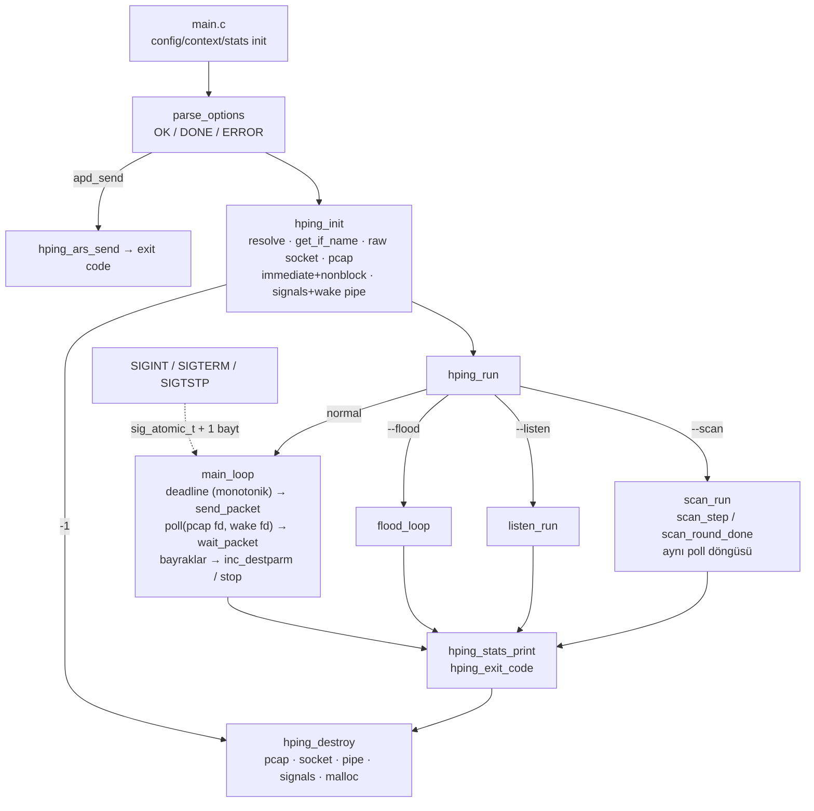

# hping3 — Aşama 2 raporu: mimari ve çalışma yaşam döngüsü

Aşama 1 teslimatının (`docs/ASAMA1-RAPORU.md`) üzerine, promptun 5. bölümü
uygulanmıştır. Kararların gerekçeleri `docs/KARAR-KAYITLARI.md` (KK-2…KK-6)
içindedir; bu rapor ne yapıldığını, nasıl doğrulandığını ve neyin
değiştiğini kaydeder. Referans: Aşama 1 sonrası çalışma ağacı (commit
edilmemiş, `3547c76` üzerine).

---

## 1. Kısa değerlendirme

**Başlangıç.** Aşama 1 sonunda derleme ve bellek güvenliği düzeltilmişti;
ancak çalışma zamanı tasarımı hâlâ 1999'dan kalmaydı: paketler `SIGALRM`
işleyicisinin içinden gönderiliyor (`malloc`, `printf`, `sendto`, `exit`
sinyal bağlamında), `SIGINT` işleyicisi istatistik basıp `exit()` yapıyor,
RTT iki ayrı duvar saati okumasından hesaplanıyor, ~100 global değişken
hiçbir test tarafından sıfırlanamıyor, `--scan` iki süreç arasında kilitsiz
paylaşımlı bellek kullanıyor ve her taramada bir SysV segmenti sızdırıyordu.
Derin fonksiyonlarda 40'tan fazla `exit()` vardı.

**Yapılan.** Durum üç açık nesneye ayrıldı (`cfg`/`ctx`/`stats`); tek
monotonik saat ve enjekte edilebilir saat/rastgelelik kaynağı; 64-bit
sayaçlar ve tanımlı kayıp formülü (DUP / eşleşmeyen ayrımı); `init/run/
stop/destroy` yaşam döngüsü ve `poll(2)` tabanlı olay döngüsü (sinyal
işleyicileri yalnızca bayrak + self-pipe); derin `exit()`'lerin tamamı hata
koduna dönüştürüldü (`parse_options` test edilebilir); `--scan` tek süreçli
durum makinesi oldu; `libars.a` bağımsız bağlanabilirliği test altına
alındı.

**Kullanıcıya etkisi.** Kesme (ctrl+c) artık her modda güvenli ve
deterministik kapanış üretir; sayaçlar taşmaz; kayıp yüzdesi `ping` ile
aynı tanımdadır ve tekrarlı/eşleşmeyen cevaplar ayrı satırda görünür;
`--scan` artık paylaşımlı bellek sızdırmaz ve port 65535'i de tarar; hatalı
ICMP türü veya `--rand-dest` şablonu ağ açılmadan reddedilir. Test paketi
723 kontrole (Aşama 1: 500) çıktı; olay döngüsü sahte saatle mikrosaniye
hassasiyetinde doğrulanıyor.

---

## 2. Kanıtlı analiz

### 2.1 Yeni çalışma modeli

- **Sahiplik.** `hping_init()` açtığı her kaynağı `ctx`'e yazar; hata
  durumunda açık kalanları `hping_destroy()` kapatır (kısmi başlatma, kesme
  ve normal bitiş aynı yoldan geçer; `tests/test_loop.c`
  `test_init_failure_cleanup`).
- **Zaman.** Tek okuma: `delaytable_add()` gönderim anını `sent_us`
  (monotonik) olarak kaydeder; `rtt()` farkı alır. Gönderim aralığı
  `hping_send_interval_us()`; deadline `ctx.next_send_us` (periyodik,
  drift'siz; geri kalınırsa patlama yapmaz). Son paketten sonra
  `COUNTREACHED_TIMEOUT` kadar geç cevap beklenir (`ctx.end_deadline_us`).
- **Sinyaller.** `on_signal()` yalnızca `sig_stop`/`sig_tstp` yazar ve
  `ctx.wake_fd[1]`'e bir bayt yazar; `handle_pending_signals()` normal
  bağlamda çalışır. `SA_RESTART` bilinçli olarak yok (bloklayan çağrılar
  `EINTR` ile döner).
- **I/O soyutlaması.** `ctx.io.wait(timeout)` / `ctx.io.read(buf,size)`;
  varsayılan `pcap_io_wait` (poll) + `pcap_recv` (non-blocking). Testler
  sahte saat ve betiklenmiş karelerle döngüyü sürer (`tests/fakeio.h`).
- **Taşınabilir temel.** POSIX.1-2001: `poll`, `pipe`, `sigaction`,
  `clock_gettime`. libpcap: `pcap_create/set_immediate_mode/activate/
  setnonblock/get_selectable_fd` (configure keşfi ile; eski libpcap'te
  `pcap_open_live` + `BIOCIMMEDIATE` yolu korunur). Seçilebilir fd yoksa
  `pcap_get_required_select_timeout()` ya da 10 ms periyodik yoklama.

### 2.2 Bulgular ve düzeltmeler (bu aşama)

| # | Konu | Eski durum (dosya:satır, Aşama 1 sonrası ağaç) | Yeni | Kanıt |
|---|---|---|---|---|
| 1 | Sinyal bağlamında iş | `send.c:67–94` (`send_packet` = SIGALRM handler: malloc/printf/sendto/alarm), `statistics.c:19–53` (SIGINT → exit), `binding.c:19–56` (SIGTSTP → printf + `signal()`), `scan.c` `do_exit` | `lifecycle.c`: bayrak + self-pipe; gönderim/çıktı/kapanış olay döngüsünde | T `test_loop` (gerçek SIGINT `poll`'u uyandırır: <1.5 s, `HPING_STOP_SIGNAL`) |
| 2 | Deep `exit()` | 47 çağrı: `parseoptions.c` (22), `sendip.c:119`, `sendicmp.c:61`, `resolve.c:52`, `getifname.c:141`, `datafiller.c:70`, `listen.c:42`, `waitpacket.c:58,502,558`, `scan.c` (8), `arsglue.c` (5), `send.c:88`, `main.c` (7) | CLI giriş noktaları dışında `exit()` yok; `parse_options` `OK/DONE/ERROR`; gönderim yolu `int` döndürür; `hping_run` çıkış kodunu döndürür | `grep exit(` (yalnız `main.c`, `script.c` Tcl_Main, `usage`/`version` yok) + `test_parse` (77), `test_loop` send-error |
| 3 | Global durum | `main.c:33–175` 100+ tanım; `globals.h` extern listesi; testler sıfırlayamıyor | `globals.h/globals.c`: `hping_config`/`hping_context`/`hping_stats` + `*_init()`; token-duyarlı mekanik yeniden adlandırma (yorum/literal/üye erişimi hariç) | derleme + 723 test; `test_parse` "state does not leak between calls" |
| 4 | Saat | `getusec.c` (`tv_usec`, `%86400`), `rtt.c:57–60`, `binding.c:41`, `scan.c` `get_midnight_ut_ms`, `script.c:379` | `clock.c`; `delaytable_element.sent_us`; `mstime()` monotonik; `milliseconds()` duvar (ICMP ts) | T `test_loop` (duvar saati 1 saat sıçrar → RTT 25.000 ms sabit; `delaytable`/`rtt` 123456 µs; `S_UNKNOWN`) |
| 5 | Rastgelelik | `rand()/srand(time)` (`sendtcp.c:60–69`, `sendip.c:64`, `main.c:283–287`) | `hping_rand()` → `ctx.random` (varsayılan rc4 `hp_rand`) | T `test_loop` (enjekte kaynak seq/ack baytlarında) |
| 6 | Sayaçlar/kayıp | `int sent_pkt/recv_pkt`; `lossrate = 100 - recv*100/sent` (DUP'ta taşma → `unsigned` çöp, 2/3 → %34) | `unsigned long long sent/received/duplicates/unmatched/out_of_sequence`; `unique = received − duplicates − unmatched`; `loss = (sent − unique)·100/sent`, `sent=0 → 0`, `unique ≥ sent → 0` | T `test_loop` (DUP ×2 → unique 1, loss %50; eşleşmeyen → loss %100; 2/3 → %33) |
| 7 | ICMP hata cevaplarının hesabı | tip 3/11 yalnızca traceroute modunda alıntı üzerinden eşleniyordu; RTT örneği yoktu | `recv_icmp` alıntı başlığı üzerinden probe'u bulur (`icmp_unreach_rtt`), durumla sayar, RTT örnekler | T `test_waitpacket` (35), `test_loop` |
| 8 | `--scan` tasarımı | `scan.c:75–124` shm, `:531–552` fork, `do_exit` sinyal-exit; segment `IPC_RMID` yalnızca hata yolunda; `for (i < MAXPORT)` 65535 atlanır | tek süreç, `struct scan_state`, `scan_step/scan_round_done`, `calloc` tablo, port 65535 dahil | T `test_scan` (71; sahte saatle tam tarama: cevaplı/cevapsız portlar, yavaşlama, 1 s son bekleme, SIGINT, gönderim hatası, bozuk liste) |
| 9 | `parse_route` argv'yi bozuyordu | `parseoptions.c:203–262` `str[j]='\0'` argv üzerinde | kopya üzerinde | T `test_parse` (literal argv ile çalışır) |
| 10 | `--apd-send` ayrıştırma sırasında gönderim | `parseoptions.c:615` | `cfg.apd_send`; `main()` ayrıştırma bitince gönderir; hedef zorunluluğu yok | T `test_parse` |
| 11 | Erken doğrulama | desteklenmeyen ICMP türü ve bozuk `--rand-dest` şablonu ancak gönderirken `exit(1)` | `parse_options` reddeder (`icmp_type_supported`, `parse_rand_dest`) | T `test_parse` |
| 12 | `libars.a` bağımsızlığı | doğrulanmamıştı | `tests/libars_link.c` yalnız arşive bağlanır, APD→binary→APD round trip | T `libars.sh` (sanitizer bayraklarıyla da) |
| 13 | Ölü kod | `signal.c` (`Signal()` sarmalayıcı), `getusec.c` | kaldırıldı (`clock.c` yerine) | derleme |

### 2.3 Sinyal işleyicisi envanteri (yeni)

| Sinyal | İşleyici | Yaptığı iş | Normal bağlamda karşılığı |
|---|---|---|---|
| SIGINT, SIGTERM | `on_signal` | `sig_stop = signo`; pipe'a 1 bayt | `handle_pending_signals` → `HPING_STOP_SIGNAL` → döngü biter → istatistik → `hping_destroy` |
| SIGTSTP (`--bind` varsayılan; `--unbind` ile yok) | `on_signal` | `sig_tstp = 1`; pipe | `inc_destparm()` (port/TTL artır, 200 ms içinde ikinci basış azaltır) |
| SIGALRM | yok | — | gönderim deadline'ı `poll` zaman aşımıyla |
| SIGCHLD | yok (fork kalktı) | — | — |

`tests/test_loop.c` `test_real_signal_wakeup`: `setitimer` 50 ms sonra
`raise(SIGINT)`; 2 s aralıklı sonsuz koşu 1.5 s'den kısa sürede
`HPING_STOP_SIGNAL` ile biter (gerçek `poll` + boru).

### 2.4 `scan.c` eşzamanlılık incelemesi (KK-4)

Eski tasarımda `struct portinfo` alanları iki süreç tarafından `volatile`
ve kilitsiz paylaşılıyordu (`active`: alıcı yazar/gönderici okur; `retry`:
gönderici; `sentms`: gönderici yazar/alıcı okur; ortalama RTT
`pi[MAXPORT+1].active` üzerinden). C11'e göre veri yarışı (UB); pratikte
x86'da `int` yazmalar atomik ama derleyici yeniden sıralayabilir/hoist
edebilir (`sender()` döngüsündeki `pi[i].active` okumaları fonksiyon
çağrıları arasında yeniden yüklenir, o yüzden "çalışıyordu"). `volatile`
tek başına garanti değildir (KK-4). Seçilen çözüm paylaşımı ortadan
kaldırır; iki süreç + C11 atomik seçeneği belgelendi, gerekmedi.

---

## 3. Öncelikli iş listesi (güncel)

| ID | P | İş | Durum |
|---|---|---|---|
| B1 | P1 | Sinyal → olay döngüsü, yaşam döngüsü, `exit()` kaldırma | **Tamam** |
| B2 | P1 | Monotonik saat, enjekte edilebilir saat/rastgelelik | **Tamam** |
| B3 | P1 | `scan.c` tasarımı | **Tamam** (tek süreç) |
| B5 | P1 | 64-bit sayaçlar, DUP/eşleşmeyen, kayıp formülü | **Tamam** |
| B4 | P1 | Ortak çekirdek (CLI gönderim → ARS) | **Ertelendi**, KK-5; Aşama 3'te `sendtcp.c` ile başla; kabul: `tests/test_core` vektörleriyle bayt-eşit |
| B6 | P2 | `cfg` "runtime-adjusted" alanlarını `ctx`'e taşı; fonksiyonlara bağlam parametresi | Açık (KK-6 koşulu) |
| C1 | P1 | Tcl 9 uyumluluğu ve sürüm matrisi | Aşama 3 |
| C2 | P1 | `.hpingrc` için açık seçenek | Aşama 3 |
| C3 | P1 | `hping build/describe/validate`, `--dry-run`, PCAP girişi | Aşama 3 — `ctx.io` sayesinde `--dry-run` ve PCAP okuma artık küçük iş (I/O soyutlaması hazır) |
| C4 | P2 | APD gramer belgesi | Aşama 3 |
| D1 | P2 | JSON/NDJSON çıktı, stdout/stderr ayrımı | Aşama 4 (bu aşamada usage-hata mesajları stderr'e taşındı) |
| F1 | P2 | Fuzz hedefleri | Açık; `ars_split_packet` ve `parse_options` girişleri hazır |
| E1 | P3 | IPv6 | Aşama 5 |

---

## 4. Kod (dosya bazında)

- **Yeni:** `globals.c` (durum nesneleri + `*_init`), `clock.c` (saat/rastgelelik,
  `getusec.c` yerine), `lifecycle.c` (init/run/stop/destroy, olay döngüsü,
  sinyaller, varsayılan I/O).
- **Kaldırılan:** `getusec.c`, `signal.c`.
- **Yeniden yazılan:** `main.c` (ince giriş noktası), `statistics.c`
  (stats modülü), `scan.c` (durum makinesi), `listen.c` (`listen_run`),
  `arsglue.c` (dönüş kodu), `libpcap_stuff.c` (`pcap_create`/immediate/
  nonblock/selectable fd; `pcap_recv` bloklamaz).
- **Değişen sözleşmeler:** `send_packet(void)→int`, `send_tcp/udp/icmp/
  rawip→int`, `send_ip(..., unsigned optlen)→int`, `send_ip_handler→int`,
  `send_hcmp→int` (doğrudan `send_packet`), `inc_destparm(void)`,
  `delaytable_add(seq, src, status)` (zaman içeride), `rtt()` → `S_UNKNOWN`
  (−1) eşleşme yoksa, `parse_options` → `HPING_PARSE_{OK,DONE,ERROR}`,
  `parse_route(…, const char*)→int`, `resolve()` kaldırıldı
  (`resolve_addr` kullanılır), `print_statistics` kaldırıldı
  (`hping_stats_print` + `hping_exit_code`), `log_traceroute(status, rtt,
  code)`.
- **Mekanik geçiş:** 27 dosyada `opt_*`/durum/istatistik globalleri
  `cfg./ctx./stats.` ön ekine (yorum, literal ve üye erişimleri hariç;
  gölgeleyen yereller elle düzeltildi).

### Testler (`make check`, 723 kontrol, 9 grup)

| Grup | Kontrol | Yeni/genişletilen |
|---|---|---|
| `test_core` | 265 | (Aşama 1) |
| `test_waitpacket` | 35 | `stats.received` üzerinden |
| `test_scan` | 71 | **+42**: durum makinesi (sahte saat) |
| `test_loop` | 103 | **yeni**: deadline/RTT/DUP/eşleşmeyen/SIGINT/gönderim hatası/`-i u0`/`-i 2`/duvar saati sıçraması/rastgelelik/kısmi init temizliği/gerçek pcap I/O (savefile)/gerçek sinyal uyandırma |
| `test_parse` | 77 | **yeni**: `parse_options` sözleşmesi |
| `test_script` | 77 | ctx init |
| `cli.sh` | 81 | değişmedi (binary davranışı korunuyor) |
| `install.sh` | 13 | — |
| `libars.sh` | 1 | **yeni**: bağımsız bağlama + round trip |

Yardımcılar: `tests/fakeio.h` (sahte saat, betiklenmiş kareler, sahte
SIGINT), `tests/stub_send.{c,h}` (gönderim zamanı/portu kaydı, hata
simülasyonu).

---

## 5. Doğrulama raporu

Ortam Aşama 1 ile aynı (Linux 7.2.2 x86_64, GCC 16.2.1, Clang 22.1.8,
glibc 2.44, libpcap 1.10.6, Tcl 8.6.16), 2026-09-21.

| Komut | Sonuç |
|---|---|
| `./configure && make -j8 WERROR=1 && make check WERROR=1` (GCC, Tcl) | 0 uyarı; 9/9 grup, 723 kontrol |
| `CC=clang ./configure && make -j8 WERROR=1 && make check WERROR=1` | 0 uyarı; 9/9 |
| `CC=clang ./configure --no-tcl && make -j8 check SANITIZE=1 WERROR=1` | ASan/UBSan/LSan temiz; 8/8 (Tcl testi yapılandırma gereği yok) |
| `CFLAGS="-O0 -g -Wall" ./configure && make -j8 check SANITIZE=1 WERROR=1` (GCC, Tcl) | temiz; 9/9 |
| `make clean && make -j8 check SANITIZE=1` (GCC, Tcl, `detect_leaks` açık) | sızıntı yok (kesme ve hata senaryoları dahil) |
| `strace -f -qq -e trace=socket,socketpair tests/test_*` | altı test binary'sinde de `socket()` çağrısı yok (gerçek-sinyal testi yalnız `pipe`/`poll`; gerçek pcap I/O testi savefile) |
| `./hping3 --help/--version` | çıkış 0, stderr boş |
| `./hping3 -c 3 -S 192.0.2.1` ve `./hping3 --scan 1-3 -S 192.0.2.1` (uid 1000) | `[open_sockraw] socket(): Operation not permitted` / `[main] can't open raw socket` → çıkış 1 (init başarısız → destroy) |

**Kabul ölçütleri (prompt §5):**
- "ağ açmadan paket oluşturma/ayrıştırma testleri çalışır" — ✅ (Aşama 1'den; ek olarak olay döngüsü ve tarayıcı da ağ açmadan).
- "test bağlamları birbirini etkilemez" — ✅ her test grubu `hping_config_init/context_init/stats_init` ile başlar; `test_parse` art arda çağrılarda sızıntı olmadığını doğrular.
- "kesme ve hata senaryoları kaynak sızıntısına yol açmaz" — ✅ `test_loop` (SIGINT, gönderim hatası, kısmi init) LSan altında temiz; `hping_destroy` idempotent.
- "saat değişimlerini simüle eden testlerde RTT/deadline hesapları tutarlıdır" — ✅ `test_loop` (duvar saati +1 saat sıçraması; deadline'lar sahte monotonik saatte mikrosaniye eşit).

**Çalıştırılamayan/doğrulanmayan:** canlı ağ (root) koşusu yapılmadı — olay
döngüsünün gerçek `pcap_create` + arayüz yolu yalnızca kod okumasıyla ve
savefile üzerinden (`test_real_pcap_io`) doğrulandı; BSD/macOS (`BIOCIMMEDIATE`
dalı, `pcap_get_selectable_fd` = −1 yolu) derlenmedi; GitHub Actions
çalıştırılmadı; `hping3-static` hâlâ bağlanmıyor (dış statik bağımlılık).

---

## 6. Uyumluluk notu

**Korunan:** tüm seçenekler ve varsayılanlar; çıktı satır biçimleri
(`len=… ip=… ttl=… id=… sport=… flags=… seq=… win=… rtt=… ms`, tarama
tablosu, "All replies received. Done.", "Not responding ports:"); çıkış
kodları (`--tcpexitcode`; cevap var → 0, yok → 1; kullanım hatası → 1;
`--help/--version` → 0); ctrl+z bağlaması; `--safe`/HCMP; `--listen`;
Tcl API'si (`hping recv` zaman aşımı artık gece yarısında bozulmaz).

**Bilinçli değişiklikler:**

1. İstatistik satırı: `N packets transmitted, M packets received, L% packet
   loss` ("tramitted" yazım hatası düzeltildi); `L` artık
   `(sent − unique)·100/sent` (2/3 cevap → %33, eskiden %34); DUP/eşleşmeyen
   varsa ek satır `D duplicate and U unmatched replies`.
2. `--count N`: "N cevap alındı" kararı benzersiz cevapla verilir (DUP'lar
   saymaz; eskiden sayıyordu). Gönderim tarafı aynı (N paket + 1 s bekleme).
3. `--flood -c N`: tam N paket gönderip durur (eskiden ~1 s daha
   gönderiyordu). `--flood`'da cevap okunmaması aynı.
4. `-i 0` (saniye): eskiden `alarm(0)` nedeniyle ilk paketten sonra
   gönderim duruyordu; şimdi `-i u0` gibi olabildiğince hızlı gönderir.
5. `--faster`/`-i u<1000>`: `poll` ms hassasiyeti nedeniyle 1 ms altı
   aralıklar beklemesiz döngüye çevrilir ("as fast as the timer allows").
6. Kullanım hatası mesajları (`Option error: …`, `missing host argument`)
   stdout yerine **stderr**'e yazılır; `--help/--version/--tos help/
   --icmp-help/--route-help` stdout'a yazıp çıkış 0.
7. Desteklenmeyen ICMP türü (`-1 -C 99` `--force-icmp`'siz) ve geçersiz
   `--rand-dest` şablonu artık ayrıştırma sırasında reddedilir (çıkış 1,
   ağ açılmadan).
8. `--apd-send`: paket ayrıştırma bittikten sonra gönderilir; diğer
   seçeneklerle birlikte verilirse yine yalnız APD paketi gönderilip
   çıkılır (öncekiyle aynı), ama artık kalan argümanlar da ayrıştırılır
   (hatalıysa gönderim yapılmaz).
9. `--scan`: port 65535 dahil; tek süreç (ps'te tek PID; `SIGCHLD` yok);
   gönderim hatası çıkış 1 (eskiden çocuk `exit(1)`); ctrl+c ile "Not
   responding ports" listesi basılmaz (eskiden de basılmıyordu), istatistik
   satırı basılmaz (eskiden `print_statistics` SIGINT'te basardı).
10. ICMP unreachable/time-exceeded cevapları artık RTT örneği üretir
    (delaytable'daki probe bulunursa); `round-trip min/avg/max` UDP'ye
    port-unreachable dönen hedeflerde 0.0 yerine gerçek değerler gösterir.
11. Sıra/ack/id rastgeleliği `rand()` yerine rc4 tabanlı `hp_rand()`
    (`/dev/urandom` tohumlu).
12. `clock_skew()` "local/remote clock delta" mutlak değeri monotonik
    tabana göredir (sapma hesabı aynı).

---

## 7. Sonraki iş paketi

**Aşama 3 — Tcl, APD ve çevrimdışı çalışma.** Bağımlılıkları tamam:
`ctx.io` ile `--dry-run`/PCAP girişi, `parse_options` sözleşmesi ile yan
etkisiz ayrıştırma, `libars.a` bağımsızlığı.

1. **C3** `--dry-run` (raw socket/pcap açmadan `send_ip_handler` yerine
   çıktı) ve `-r/--read pcap` (ctx.io savefile) — küçük; `hping build/
   describe/validate` Tcl komutları (`GetPacketDescription` hazır).
2. **C1** Tcl 9: `Tcl_Size` typedef'i var; `Tcl_ObjType` sürüm alanı ve
   `Tcl_Main` imzası için derleme matrisi (Tcl 9 ortamı gerekir).
3. **C2** `.hpingrc` açık seçenek/`HPING_NORC`.
4. **B4/KK-5** `sendtcp.c` → ARS geçişi (bayt-eşit vektörlerle).
5. **F1** libFuzzer hedefleri (`ars_split_packet`, `ars_d_build`,
   `parse_options`).

**Kalan riskler:** canlı ağ doğrulaması yapılmadı (özellikle `pcap_create`
immediate mode + non-blocking okuma Linux'ta beklendiği gibi olmalı;
BSD'de `BIOCIMMEDIATE` dalı derlenmedi); `--listen` modu `ctx.io.wait(-1)`
ile seçilebilir fd olmayan backend'de 10 ms yoklama yapar; `cfg`'deki
"runtime-adjusted" alanlar (KK-6) eşzamanlı oturumları engeller.
