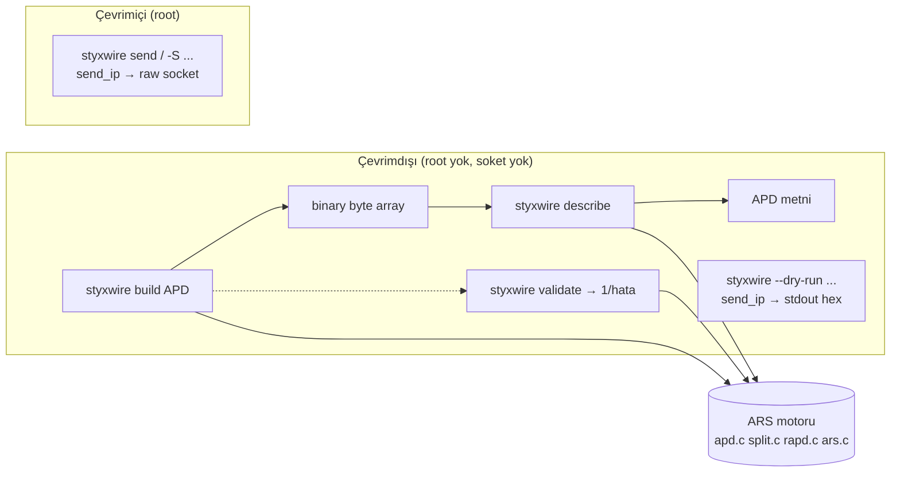

# StyxWire — Aşama 3 raporu: Tcl, APD ve çevrimdışı çalışma

Aşama 2 (`docs/ASAMA2-RAPORU.md`) üzerine, promptun 6. bölümü uygulanmıştır.
Bu aşamada ayrıca proje **StyxWire** olarak yeniden adlandırıldı (kullanıcı
isteği; karar kaydı KK-7). Kararların gerekçeleri `docs/KARAR-KAYITLARI.md`
(KK-7, KK-8) içindedir. Referans: Aşama 2 sonrası ağaç (`cbc1497`).

---

## 1. Kısa değerlendirme

**Başlangıç.** Aşama 2 sonunda çalışma zamanı sağlamdı, ama: Tcl bağlayıcısı
yalnızca Tcl 8.6 ile derleniyordu (`Tcl_Obj *CONST`, Tcl 9'da kaldırıldı);
çevrimdışı yetenek yoktu — bir paketi kurup göndermeden görmek ya da bir APD
tanımının derlenip derlenmediğini denemek için raw socket gerekiyordu;
`~/.hpingrc` koşulsuz yükleniyor ve hataları yutuluyordu (testler kullanıcı
ortamına bağlıydı); ARS ayrıştırıcısı için fuzz altyapısı yoktu; `docs/APD.txt`
gramer olarak kodla uyumsuzdu (`{}` ve `ipopt.*`, oysa kod `()` ve `ip.*`).

**Yapılan.** Tcl 9 desteği (tek kaynak 8.6 ve 9.0'da `-Werror` temiz derlenir
ve tüm test paketi geçer); çevrimdışı komutlar `styxwire build/describe/
validate` (soket yok); `--dry-run` (paketleri kurup yazar, göndermez, raw
socket açmaz, root gerekmez); başlangıç dosyası denetimi (`STYXWIRE_NORC`,
`STYXWIRE_RC`, `~/.styxwirerc`); üç libFuzzer hedefi (`make fuzz`) ve CI
smoke işi; `docs/APD.txt` uygulamaya göre yeniden yazıldı (her örnek
doğrulandı). Ürün adı StyxWire; `hping3`/`hping2`/`hping` symlink olarak
korundu.

**Kullanıcıya etkisi.** Paket üretimi/incelemesi artık ayrıcalıksız
kullanılabilir (`--dry-run`, `styxwire build/describe/validate`); scriptler
Tcl 9 ile de çalışır; test ortamı kullanıcının `~/.hpingrc`'sinden
etkilenmez; APD belgesi gerçekten geçerli örnekler içerir. Test paketi 771
kontrole çıktı (Aşama 2: 723); 10 grup, Tcl 8.6 ve 9.0'da ayrı ayrı yeşil.

---

## 2. Kanıtlı analiz

### 2.1 Yapılan işler ve kanıt

Kanıt: **T** = test; **B** = derleme/çalıştırma; **D** = doğrulanmış örnek.

| # | İş | Ayrıntı | Kanıt |
|---|---|---|---|
| 1 | Tcl 9 (C1, KK-8) | `Tcl_Obj *CONST objv[]` → `Tcl_Obj *const objv[]` (17 fonksiyon); `Tcl_Size` typedef'i Aşama 1'den. configure Tcl 9.0'ı bulur (`tcl9.0` pkg-config / tclConfig.sh). | B: Tcl 9.0.1 kaynağından statik derlendi, `--with-tcl` + `-Werror` temiz; T: `test_script` 102 kontrol Tcl 9'da geçti; smoke: `tcl_patchLevel 9.0.1`, getfield/checksum/`** 2 100`/byte-array sendraw |
| 2 | `styxwire build` | APD → binary byte array; `-nocompile` ile açık alanlar korunur; hatalar Tcl hatası | T: `test_script` build/describe round trip, byte uzunluğu, geçersiz tanım hata |
| 3 | `styxwire describe` | binary (byte array) → APD; `-hex` veri gösterimi; kısa paketler | T: `test_script`; `GetPacketDescription` hazırdı (Aşama 1) |
| 4 | `styxwire validate` | APD derlenir mi? (1 / hata mesajı); soket yok | T: `test_script`; D: `docs/APD.txt`'in 10 örneği `validate` = 1 |
| 5 | `styxwire` Tcl komut adı | `hping` ile birlikte kayıtlı; `styxwire_version` değişkeni | T: `test_script` |
| 6 | `--dry-run` (C3) | paketleri kurup tek satır hex olarak yazar; `send_ip` göndermez; `hping_init` raw socket ve pcap açmaz; olay döngüsü yalnızca `nanosleep` ile bekler; çıkış 0 | T: `cli.sh` (iki 40-baytlık datagram, proto/dport/SYN doğru, `--udp` proto 17, `SOCK_RAW` yok); B: uid 1000'de çalışır |
| 7 | Başlangıç dosyası (C2) | `STYXWIRE_NORC` (hiçbiri), `STYXWIRE_RC=path`, `~/.styxwirerc` > `~/.hpingrc`; hata stderr'e, yine de ölümcül değil; `hping_script_interp()` test girişi | T: `rcfile.sh` (8 kontrol) |
| 8 | Fuzz (F1) | `make fuzz` (clang, `-fsanitize=fuzzer,address,undefined`): `fuzz_split` (binary→katman→APD), `fuzz_apd` (APD→paket), `fuzz_opts` (argv→parse_options, stub ile göndermez) | B: her hedef 200000 çalıştırma, crash yok; CI'da 60 s/hedef |
| 9 | APD belgesi (C4) | `docs/APD.txt` `()` ve `ip.*/tcp.*` ile yeniden yazıldı; alias politikası (tcp.echo/echoreq, tcp.ts/timestamp); alan listeleri koddan çıkarıldı | D: 10 örnek `validate` ile doğrulandı |
| 10 | StyxWire yeniden adlandırma (KK-7) | binary `styxwire`; `hping3/2/` symlink; man `styxwire.8` (+`hping3.8` symlink); tanı öneki `styxwire:`; `STYXWIRE_VERSION`; `STYXWIRE_LIBDIR` | T: `cli.sh` (`--version` "StyxWire ... based on hping3"), `install.sh` (symlink'ler) |

### 2.2 Çevrimdışı akış

`build`↔`describe` aynı ARS motorunu kullanır; `--dry-run` ile canlı gönderim
tek fark `send_ip`'in son adımıdır (yaz vs `sendto`).

### 2.3 Tcl 8.6 / 9 farkı

Tek kaynakta gereken tek değişiklik `Tcl_Obj *const objv[]` idi (`CONST`
makrosu Tcl 9'da kaldırıldı; `const` her iki sürümde geçerli). `Tcl_Size`
Aşama 1'de 8.x için `int` olarak typedef edilmişti; Tcl 9'da başlıktan gelir.
`Tcl_GetStringFromObj`, `Tcl_GetByteArrayFromObj` uzunluk parametreleri
zaten `Tcl_Size` yerel değişkenlerine yazılıyor. `panic()` yerine
`Tcl_Panic()` (Aşama 1). Deprecated API kullanılmadı.

---

## 3. İş listesi (güncel)

| ID | P | İş | Durum |
|---|---|---|---|
| C1 | P1 | Tcl 9 uyumluluğu ve sürüm matrisi | **Tamam** (8.6 + 9.0 doğrulandı) |
| C2 | P1 | `.hpingrc`/başlangıç dosyası denetimi | **Tamam** |
| C3 | P1 | `build/describe/validate`, `--dry-run` | **Tamam** |
| C4 | P2 | APD gramer belgesi | **Tamam** |
| F1 | P2 | Fuzz hedefleri | **Tamam** |
| C3b | P2 | PCAP okuma (`-r file`, çevrimdışı okuma) | **Ertelendi** — `ctx.io` savefile yolu hazır (`test_loop` kullanıyor); CLI seçeneği ve link-layer koruması Aşama 5 (IPv6/pcap) ile |
| B4 | P1 | Ortak çekirdek (CLI gönderim → ARS) | **Ertelendi** (KK-5); Aşama 4'te |
| D1 | P2 | JSON/NDJSON çıktı | Aşama 4 |
| E1 | P3 | IPv6 | Aşama 5 |
| B6 | P2 | `cfg` → `ctx` bağlam parametresi | Açık (KK-6) |

---

## 4. Kod

- **Yeni dosyalar:** `docs/APD.txt` (yeniden yazıldı), `docs/ASAMA3-RAPORU.md`,
  `tests/rcfile.sh`, `tests/fuzz/fuzz_split.c`, `tests/fuzz/fuzz_apd.c`,
  `tests/fuzz/fuzz_opts.c`.
- **Yeniden adlandırma:** `docs/hping3.8` → `docs/styxwire.8`; `release.h`
  (`STYXWIRE_NAME/PROG/VERSION`, `RELEASE_VERSION` hping3 tabanı); `version.c`,
  `usage.c`, `statistics.c`, `lifecycle.c`, `main.c`, `parseoptions.c` tanı
  ve başlık metinleri; `Makefile.in` (`PROG=styxwire`, symlink kurulum,
  `make fuzz`); `configure` (`STYXWIRE_LIBDIR`, özet metni).
- **script.c:** `Tcl_Obj *const`; `HpingBuildCmd`/`HpingDescribeCmd`/
  `HpingValidateCmd` + subcmd tablosu; `styxwire` komut adı ve
  `styxwire_version`; başlangıç dosyası mantığı; `hping_script_interp()`;
  `<sys/stat.h>`.
- **Sözleşme değişiklikleri:** `globals.h` `cfg.opt_dry_run`;
  `parseoptions.c` `OPT_DRY_RUN`; `sendip.c` dry-run çıktısı; `lifecycle.c`
  dry-run init/loop.

### Testler (`make check`, 10 grup)

| Grup | Kontrol | Bu aşama |
|---|---|---|
| test_core | 265 | — |
| test_waitpacket | 35 | — |
| test_scan | 71 | — |
| test_loop | 103 | — |
| test_parse | 77 | — |
| test_script | 102 | **+25**: build/describe/validate, styxwire komut adı |
| cli.sh | 89 | **+8**: --dry-run (proto/dport/flag, --udp, SOCK_RAW yok), --version StyxWire |
| install.sh | 17 | **+4**: styxwire binary + hping3/hping2 symlink, man symlink |
| rcfile.sh | 8 | **yeni**: başlangıç dosyası denetimi |
| libars.sh | 1 | — |
| **Toplam** | **771** | (Tcl açık) |

Fuzz hedefleri `make check`'in parçası değildir (clang ve zaman bütçesi
gerekir); CI'da ayrı iş.

---

## 5. Doğrulama raporu

Ortam Aşama 1/2 ile aynı; ek olarak Tcl 9.0.1 kaynaktan statik derlendi
(`scratchpad/tcl9/install`), 2026-09-21.

| Komut | Sonuç |
|---|---|
| `./configure && make -j8 WERROR=1 && make check WERROR=1` (GCC, Tcl 8.6) | 0 uyarı; 10/10 grup, 771 kontrol |
| `CC=clang ./configure && make -j8 WERROR=1 && make check WERROR=1` | 0 uyarı; 10/10 |
| `TCL_CONFIG=.../tcl9 ./configure --with-tcl && make -j8 WERROR=1 && make check WERROR=1` | 0 uyarı; 10/10 (test_script 102, Tcl 9.0.1) |
| `CC=clang ./configure --no-tcl && make -j8 check SANITIZE=1 WERROR=1` | ASan/UBSan/LSan temiz; 9/9 |
| `make clean && make -j8 check SANITIZE=1` (GCC, Tcl) | temiz; 10/10 |
| `make fuzz CC=clang` + her hedef 200000 çalıştırma | crash/sanitizer bulgusu yok |
| `styxwire --dry-run -c2 -S -p80 -a 10.0.0.1 10.0.0.2` (uid 1000) | çıkış 0; iki 40-baytlık TCP SYN datagramı hex; `strace`: `SOCK_RAW` yok |
| `styxwire build/describe/validate` (uid 1000, STYXWIRE_NORC) | round trip doğru; 10 APD.txt örneği `validate`=1 |
| `styxwire --version` | `StyxWire version 0.3.0 (based on hping3 3.0.0-alpha-1)` |

**Kabul ölçütleri (prompt §6):**
- Tcl/APD örnekleri tanımlı davranışı korur — ✅ (`test_script`, `cli.sh`; 8.6 ve 9.0).
- callback ekleme/silme ve çoklu paket alımı — ✅ (Aşama 1/2'den `test_script`, `test_loop`).
- çevrimdışı dönüşümler root ve ağ olmadan çalışır — ✅ (`--dry-run`, build/describe/validate; `strace` ile doğrulandı).
- round-trip farkları normalizasyonla sınırlı — ✅ (`test_core` bayt-eşit round trip Aşama 1'den; describe→build aynı baytlar).
- testler kullanıcı başlangıç dosyasını çalıştırmaz — ✅ (`STYXWIRE_NORC`/`STYXWIRE_RC`; `rcfile.sh`).

**Doğrulanmayan:** canlı ağ (root) gönderim/alım; BSD/macOS; Tcl 9 yalnızca
kaynaktan derlenen 9.0.1 ile (dağıtım paketi denenmedi); `styxwire build`
ile üretilip gerçek ağda gönderilen paket (yalnız `--dry-run`/çevrimdışı
doğrulandı); PCAP dosyası okuma CLI seçeneği (C3b ertelendi); GitHub Actions
çalıştırılmadı.

---

## 6. Uyumluluk notu

**Korunan:** tüm CLI seçenekleri, çıkış kodları, çıktı satır biçimleri, Tcl
komutları ve argüman sırası, APD sözdizimi; `hping`/`hping2`/`hping3` adları
(symlink + Tcl komutu), `hping_version` değişkeni, `~/.hpingrc` (yedek).

**Bilinçli değişiklikler:**

1. Binary adı `styxwire`; `hping3`/`hping2`/`hping` symlink. Tanı mesajları
   ve istatistik başlığı `styxwire`/`STYXWIRE` yazar (betikler bunları
   ayrıştırıyorsa etkilenir). `--version` çıktısı değişti (StyxWire sürümü +
   hping3 tabanı).
2. Başlangıç dosyası: `~/.styxwirerc` varsa `~/.hpingrc` yerine kullanılır;
   `STYXWIRE_NORC`/`STYXWIRE_RC` ile denetlenir; başlangıç dosyasındaki
   sözdizimi hatası artık stderr'e yazılır (eskiden sessizdi), yine de
   ölümcül değil.
3. `styxwire recvraw`/`build`/`describe` byte array (ikili) ile çalışır
   (Aşama 1'de `recvraw`/`sendraw` için başlamıştı); ASCII-dışı bayt içeren
   paketleri string olarak işleyen eski scriptler etkilenebilir.
4. Yeni: `--dry-run`, `styxwire build/describe/validate` Tcl komutları,
   `styxwire` Tcl komut adı, `styxwire_version` değişkeni.
5. Tcl 9 ile derlenebilir; Tcl 9 altında `hping recvraw` gibi ikili
   sonuçlar UTF-8 değil byte-array olarak döner (zaten öyleydi).

---

## 7. Sonraki iş paketi

**Aşama 4 — profesyonel CLI ve otomasyon** (prompt §7):

1. **D1** JSON/NDJSON çıktı (şema sürümü, olay türü, hedef, protokol, seq,
   RTT birimi, zaman damgası, sayaçlar); yapılandırılmış çıktı açıkken
   stdout yalnız o biçim, tanılar stderr. `hping_stats`/`log_ip` çıktısı tek
   noktadan geçirilmeli.
2. **B4/KK-5** `sendtcp.c` → ARS geçişi (bayt-eşit vektörlerle); `--fast`/
   `--faster` birim/belge tutarlılığı zaten çözüldü (Aşama 1).
3. **C3b** `-r/--read file.pcap` (çevrimdışı okuma, `ctx.io` savefile yolu),
   link-layer türü koruması.
4. Kabuk tamamlama ve man sayfası örnekleri.

**Kalan riskler:** canlı ağ doğrulaması yapılmadı; ARS ile CLI gönderim yolu
hâlâ ayrı (çift bakım); JSON çıktı yok; `styxwire build` çıktısı gerçek ağda
sınanmadı; Tcl 9 dağıtım paketi (yalnız kaynaktan derlenen) denenmedi.
