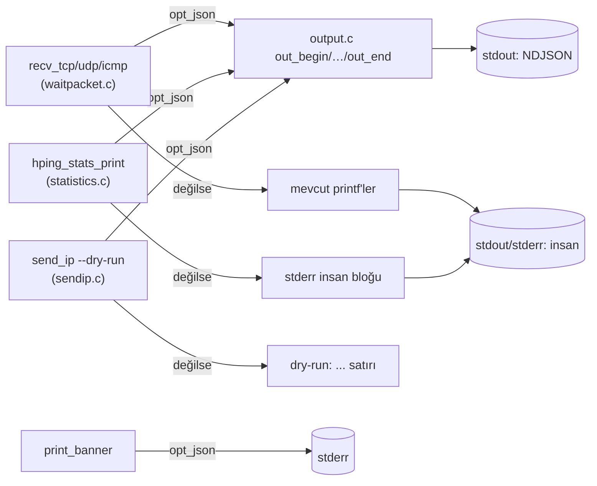

# StyxWire — Aşama 4 raporu: profesyonel CLI ve otomasyon

Aşama 3 (`docs/ASAMA3-RAPORU.md`) üzerine, promptun 7. bölümünün otomasyon
odaklı maddeleri uygulandı. Kararların gerekçeleri `docs/KARAR-KAYITLARI.md`
(KK-9, KK-10). Referans: Aşama 3 sonrası ağaç (`0f81d5d`).

---

## 1. Kısa değerlendirme

**Başlangıç.** Araç insan-okur çıktıdan başka bir şey üretmiyordu; bir betik
yanıtları ancak metin satırlarını ayrıştırarak alabiliyordu (kırılgan). Bir
paketin gerçekte ne olacağını görmek `--dry-run` ile mümkündü ama çıktı yine
düz metindi; yakalanmış bir pcap'i root olmadan çözümlemenin yolu yoktu.

**Yapılan.** `--json` ile satır başına bir JSON nesnesi (NDJSON) veren
yapılandırılmış çıktı: reply, icmp-unreachable, icmp-timeexceeded, packet ve
statistics olayları; tanılar ve banner stderr'e. İnsan çıktısı `--json`
kapalıyken **bayt-bayt korunuyor** (her yanıt noktasında ayrı dal).
`--read file.pcap` ile çevrimdışı pcap çözümleme (root yok, gönderim yok);
`--json` ile birleşince tam bir çevrimdışı boru hattı. Bilinmeyen değer
`null` olarak yazılıyor (yanıltıcı 0 değil).

**Kullanıcıya etkisi.** `styxwire --json ... | jq` gibi bir akış artık
mümkün; `--dry-run --json` root'suz paket üretimini yapılandırılmış verir;
`--read cap.pcap --json` yakalanmış trafiği root'suz çözümler. Test paketi
777 kontrole çıktı (Aşama 3: 771), 11 grup; Tcl 8.6 ve 9.0'da, ASan/UBSan
altında ve fuzz smoke ile temiz.

---

## 2. Kanıtlı analiz

### 2.1 Yapılan işler

| # | İş | Ayrıntı | Kanıt |
|---|---|---|---|
| 1 | NDJSON çıktı (D1, KK-9) | `output.c`/`output.h`: `out_begin/str/int/uint/double/bool/null/ipv4/end`; RFC 8259 string kaçışları; `schema:1` + `ts` (duvar saati ms). Yanıt/hata/istatistik/packet olayları. İnsan yolu değişmedi. | T: `test_output` (18, kaçış/null/64-bit/IPv4), `test_loop` (--json senaryosu), `cli.sh` (--json), python3 ile geçerli JSON |
| 2 | stdout yalnız NDJSON, tanılar stderr | `--json` altında banner ve "dry-run/reading" satırları stderr'e; istatistik stdout'a JSON olayı olarak | T: `cli.sh` ("stdout is only JSON objects", "banner on stderr") |
| 3 | Bilinmeyen değer = null | eşleşmeyen yanıtın `rtt_ms`'i, örneklem yokken istatistik RTT'leri `null` | T: `test_output`, `test_loop` (rtt_ms null), `cli.sh` |
| 4 | `--dry-run` + `--json` | dry-run çıktısı "packet" olayı (to/bytes/hex) olur; stdout saf NDJSON | T: `cli.sh` (iki packet + bir statistics, hepsi parse edilir) |
| 5 | `--read file.pcap` (C3b, KK-10) | çevrimdışı pcap çözümleyici: raw socket yok, gönderim yok, EOF'a kadar oku; `rtt_ms` null (probe yok); DLT dosyadan; uzun seçenek (`-r` `--rel`'de) | T: `cli.sh` (pcap fixture, reply SA, rtt null, sent 0, SOCK_RAW yok, eksik dosya hata) |
| 6 | Man/belge tutarlılığı | `docs/JSON.txt` (şema); man'de `--dry-run/--json/--read` eklendi, "signal-driven" ve "two-processes" tanımları güncellendi; APD/JSON belgeleri kodla uyumlu | D: man metni, JSON.txt |

### 2.2 Çıktı mimarisi

Her yanıt/istatistik noktasında JSON dalı ile insan dalı ayrı; `output.c`
tek başına birim-test edilir (`test_output`, yakalanan `FILE*`).

### 2.3 Ertelenen

- **B4/KK-5** CLI gönderim yolu → ARS birleştirme: Aşama 4'e planlanmıştı
  ama otomasyon temasına JSON/`--read`'ten daha az hizmet ediyor ve riskli;
  `tests/test_core` bayt-eşit vektörleri hazır olduğundan sonraki turda
  `sendtcp.c` ile başlanabilir. Bu aşamada yapılmadı.
- Kabuk tamamlama: CLI sözleşmesi artık sabit; bash/zsh completion küçük
  ve düşük riskli bir sonraki ek (yapılmadı).
- JSON'da hex dump (-j/-J) ve `--seqnum` özel modu: "packet"/`--read` ile
  veri erişimi var; bu iki mod JSON'a taşınmadı (kapsam, JSON.txt'de not).

---

## 3. Doğrulama raporu

Ortam Aşama 1-3 ile aynı; Tcl 9.0.1 kaynaktan (scratchpad), 2026-09-21.

| Komut | Sonuç |
|---|---|
| `./configure && make -j8 WERROR=1 && make check WERROR=1` (GCC, Tcl 8.6) | 0 uyarı; 11/11 grup, 777 kontrol |
| `CC=clang ./configure && make check WERROR=1` | 11/11 |
| `TCL_CONFIG=.../tcl9 ./configure --with-tcl && make -j8 WERROR=1 && make check` | 11/11 (test_script 102, Tcl 9.0.1) |
| `CC=clang ./configure --no-tcl && make -j8 check SANITIZE=1 WERROR=1` | ASan/UBSan/LSan temiz; 9/9 + 1 skip (Tcl'siz) |
| `make clean && make -j8 check SANITIZE=1` (GCC, Tcl) | temiz; 11/11 |
| `make fuzz CC=clang` + her hedef 300000 çalıştırma | crash yok |
| `styxwire --json --dry-run -c2 -S -p80 10.0.0.1` (uid 1000) | 2 packet + 1 statistics olayı; python3 ile geçerli JSON; banner stderr'de |
| `styxwire --read cap.pcap --json -S -p80 -a 10.0.0.1 10.0.0.2` (uid 1000) | reply olayı (flags SA, rtt_ms null), statistics (sent 0); `strace`: SOCK_RAW yok |

**Kabul ölçütleri (prompt §7):**
- JSON şema testleri ve CLI regresyonları geçer — ✅ (`test_output`, `test_loop` --json, `cli.sh`).
- yardım ile gerçek seçenekler tutarlı — ✅ (`cli.sh` `--fast/--faster/-w`; yeni seçenekler usage'da ve man'de).
- hatalı girdi ağ işlemi başlamadan reddedilir — ✅ (Aşama 1/3'ten; `parse_options` OK/DONE/ERROR).
- yapılandırılmış çıktı etkinken stdout yalnız o biçim, tanılar stderr — ✅ (`cli.sh`).
- bilinmeyen değer yanıltıcı sıfıra dönüşmez — ✅ (`null`; `test_output`/`cli.sh`).
- etkilenen davranışlar geçiş notunda — ✅ (§4).

**Doğrulanmayan:** canlı ağ (root) gönderim/alım; BSD/macOS; GitHub Actions
koşusu; JSON'da hex dump/seqnum modu; `styxwire build` çıktısının gerçek ağda
gönderimi; ARS ile CLI gönderim yolu hâlâ ayrı (B4).

---

## 4. Uyumluluk notu

**Korunan:** tüm mevcut seçenekler, çıkış kodları, insan çıktı satır
biçimleri (`--json` kapalıyken bayt-bayt), Tcl API, APD dili, `hping*`
adları. `--json`/`--read`/`--dry-run` yeni seçeneklerdir; varsayılan
davranış değişmez.

**Yeni / bilinçli:**

1. `--json`: stdout NDJSON, stderr tanılar. `--json` açıkken insan yanıt
   satırları ve istatistik bloğu yerine olaylar üretilir; çıkış kodu aynı.
   `opt_quiet` JSON olaylarını bastırmaz (quiet insan gürültüsü içindir).
2. `--read file.pcap`: alım-yalnızca çevrimdışı çözümleme; gönderim yok,
   raw socket yok. `rtt_ms` null. `-r` kısa harfi `--rel`'de olduğu için
   yalnız uzun seçenek.
3. `--dry-run --json`: paketler "packet" olayı olarak (to/bytes/hex).
4. Man sayfası: `--faster` "signal-driven" ifadesi kaldırıldı; `--scan`
   "two-processes/shared memory" tanımı tek olay döngüsü olarak
   güncellendi (Aşama 2 gerçeğini yansıtır).

---

## 5. Sonraki iş paketi

**Aşama 5 — IPv6, taşınabilirlik ve performans** (prompt §8), ve devreden:

1. **B4/KK-5** `sendtcp.c` → ARS geçişi (bayt-eşit vektörlerle); çift bakımı
   bitirir.
2. **IPv6 çevrimdışı dilimi** (prompt §8): `sockaddr_storage`/`getaddrinfo`,
   IPv6 başlık modeli ve pseudo-header checksum, ICMPv6 — önce çevrimdışı
   test vektörleri (`test_core` tarzı), sonra yerel laboratuvar.
3. Kabuk tamamlama; JSON'a hex dump alanı (isteğe bağlı).
4. Canlı ağ doğrulaması (yerel veth/namespace), BSD derleme.

**Kalan riskler:** canlı ağ doğrulanmadı; ARS/CLI gönderim yolu ayrı; JSON
şeması v1 (alanlar eklenebilir; tüketici bilinmeyeni yok saymalı); BSD/macOS
ve GitHub Actions denenmedi.
